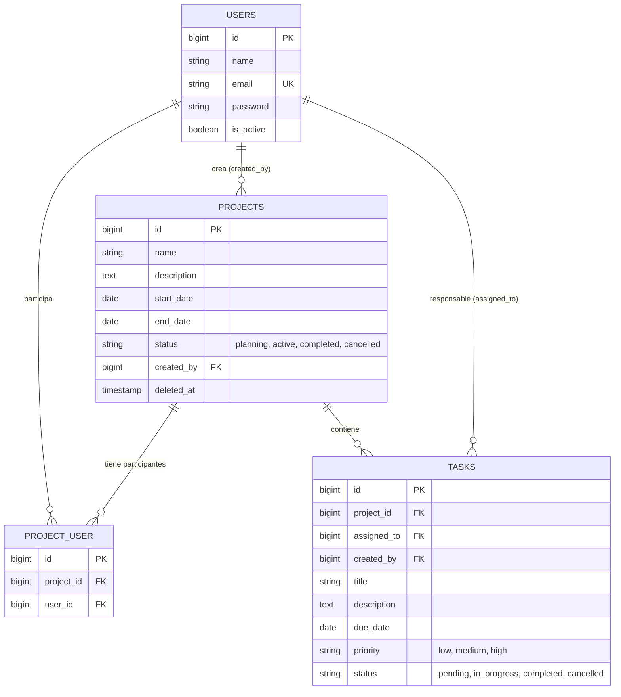

# Modelo de datos de TaskFlow API

```mermaid
erDiagram
    USERS ||--o{ PROJECTS : "crea (created_by)"
    USERS ||--o{ PROJECT_USER : "participa"
    PROJECTS ||--o{ PROJECT_USER : "tiene participantes"
    PROJECTS ||--o{ TASKS : "contiene"
    USERS ||--o{ TASKS : "responsable (assigned_to)"

    USERS {
        bigint id PK
        string name
        string email UK
        string password
        boolean is_active
    }
    PROJECTS {
        bigint id PK
        string name
        text description
        date start_date
        date end_date
        string status "planning, active, completed, cancelled"
        bigint created_by FK
        timestamp deleted_at
    }
    PROJECT_USER {
        bigint id PK
        bigint project_id FK
        bigint user_id FK
    }
    TASKS {
        bigint id PK
        bigint project_id FK
        bigint assigned_to FK
        bigint created_by FK
        string title
        text description
        date due_date
        string priority "low, medium, high"
        string status "pending, in_progress, completed, cancelled"
    }
```